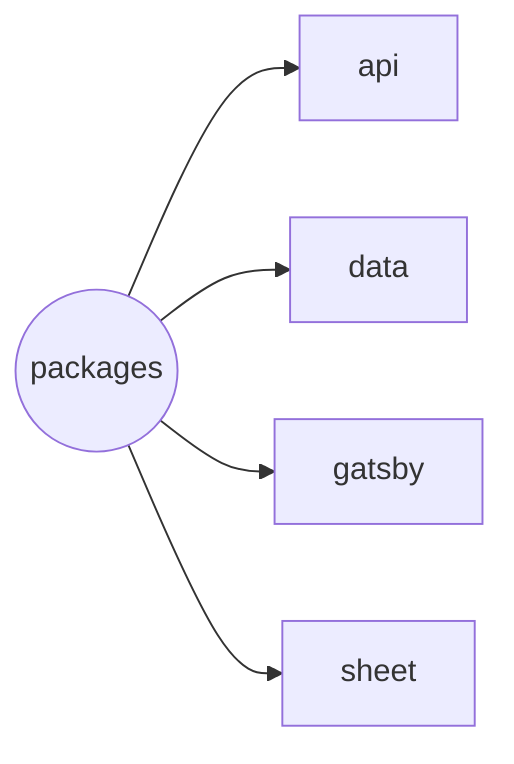

# Monorepo of Henrique Godinho's Curriculum Vitae

| Package | Deploy |
| --- | --- |
| gatsby |  |

---

## [api](./packages/api/README.md)

Simple back-end service created with [apps script](https://developers.google.com/apps-script?hl=pt-br).

## [data](./packages/data/README.md)

Gatsby plugin to fetch data from Google Sheets.

## [gatsby](./packages/gatsby/README.md)

Gatsby site.

## [sheet](./packages/sheet/README.md)

Simple scripts to run `onEdit()` and `onOpen()` functions on Google Sheets data tables.
