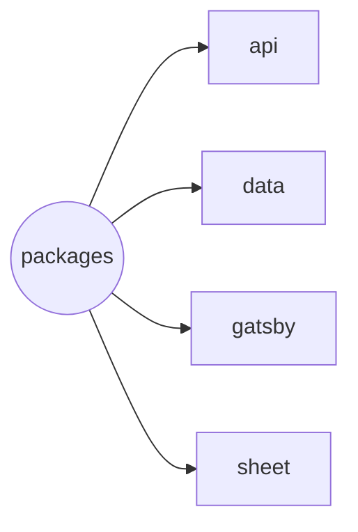

# Monorepo of Henrique Godinho's Curriculum Vitae

| Package | Deploy |
| --- | --- |
| gatsby |  |

## Packages

---



### [api](./packages/api/README.md)

Simple back-end service created with [apps script](https://developers.google.com/apps-script?hl=pt-br).

### [data](./packages/data/README.md)

Gatsby plugin to fetch data from Google Sheets and create gatsby pages

### [gatsby](./packages/gatsby/README.md)

Gatsby site.

### [sheet](./packages/sheet/README.md)

Simple scripts to run `onEdit()` and `onOpen()` functions on Google Sheets data tables.

## Docker

Since we need two `.clasprc.json` files, one for the global scope and another for the `packages/api` scope, and we no longer can run [`clasp login --no-localhost`](https://github.com/google/clasp/issues/948) to prompt the user to paste the authorization code, one option would be to run the `clasp login` command on the host machine to generate the `.clasprc.json` files.

```sh
clasp login
cp ~/.clasprc.json ./.clasprc.json # global scope
```

```sh
cd packages/api
clasp login --creds creds.json # api scope
```

The `creds.json` file can be downloaded from the [Google Cloud Console](https://console.cloud.google.com/apis/credentials), just click on the download button and rename the file to `creds.json`.

Another option, or if we don´t want to install the dependencies on the host machine (node and clasp), we can run a docker container with the `clasp` command and copy the `.clasprc.json` file to the host machine:

```sh
# On the host machine
docker run -it --rm -v .:/app -w /app node:23-alpine sh
```

```sh
# On the container
npm install -g @google/clasp
clasp login # global scope
```

This will prompt the user to login in the browser and accept the permissions to use the clasp cli, and wait for the redirection to complete. But this will never complete, because we can't predict the random port that clasp use to expose in docker commands. So we copy the broken redirect url, open a new terminal and run the following commands to get the `.clasprc.json` file:

```sh
# On the host machine, new terminal tab
docker ps # list the containers ids
docker exec -it <container_id> sh
```

```sh
# On the container
apk update && apk add curl
curl <redirect_url>
# you can close this terminal tab
```

On the first terminal tab that we opened, we should see the message `Authorization successful. Default credentials saved to: /root/.clasprc.json.`. Now we can copy this file to the host machine:

```sh
# On the container
cp /root/.clasprc.json /app/.clasprc.json
```

Now we need to login to the script `packages/api` itself.

```sh
# On the container
cd packages/api
clasp login --creds creds.json
```

And repeat the `curl` process in another terminal to get the `.clasprc.json` file.

```sh
curl <redirect_url>
```

This will generate the `.clasprc.json` file. You can safely close the container typing `exit` on the container terminal.

To build the image and run the composer, use the following command:

```sh
# On the host machine
# root dir
docker compose up -d
```
