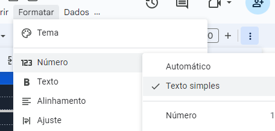

> /packages/api/README.md

# `@hgod-in-cv/api`

Simple back-end made with Google Apps Script.

## Description

## Observations

- The data format from sheet must be marked as simple text, otherwise some data may be returned wrong.

