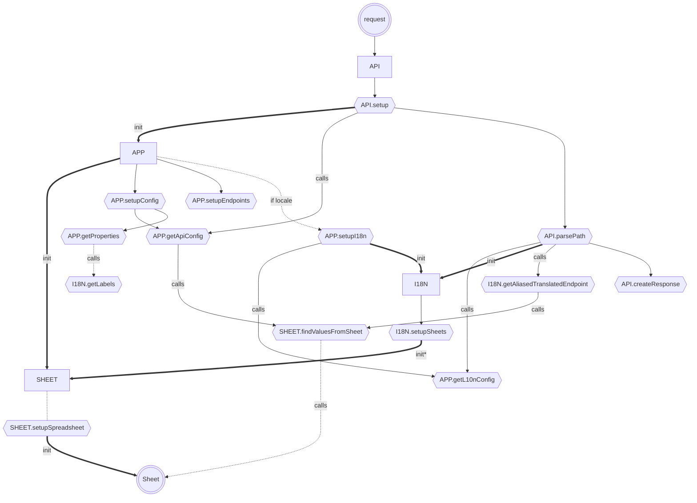
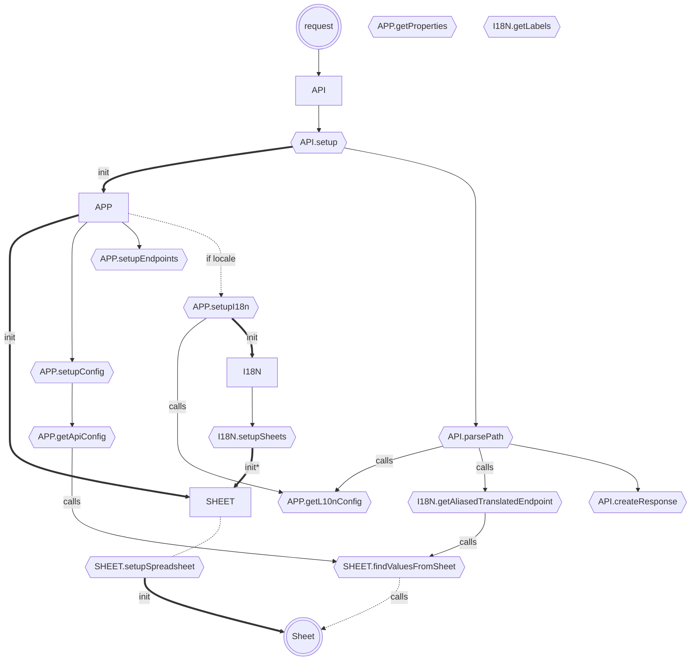
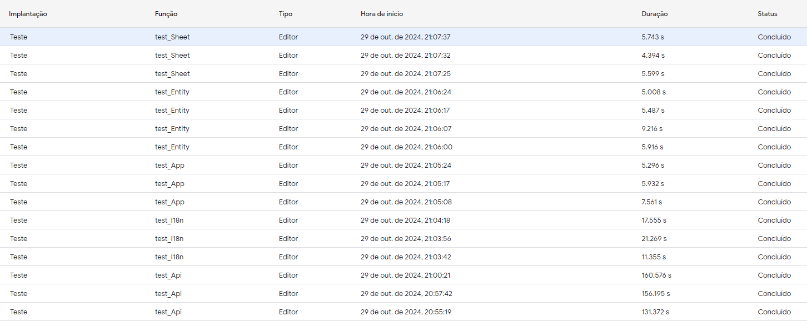

# Fluxo

---

> análise realizada no dia 2024-10-29

Como a requisição do apps script tem um limite de execução de [360 segundos (6 minutos)](https://developers.google.com/apps-script/guides/services/quotas?hl=pt-br#current_limitations), é necessário que o código seja o mais eficiente possível para que não haja problemas de execução, no gráfico abaixo é possível ver a sequência de chamadas que o código faz para que cada requisição seja processada, além desses passos, o código ainda vai executar outras funções baseadas no tipo de requisição recebida.

Como podemos ver no gráfico, para requisição executada pelo apps script, o código passa por várias funções, sendo que algumas delas são chamadas de forma condicional, como por exemplo a função `app.setupI18n` que só é chamada se o locale estiver presente. Além disso, o código ainda faz chamadas para a planilha para buscar os valores necessários para a execução da requisição, o que leva tempo e consome recursos, atualmente algumas requisições podem passar dos 500 segundos apresentando problemas na build do [site gatsby](../../gatsby/README.md).

| Teste       | Tempo 1 (s) | Tempo 2 (s) | Tempo 3 (s) | Média (s) |
| ----------- | ----------- | ----------- | ----------- | --------- |
| test_Sheet  | 5.093       | 6.382       | 3.798       | 5.091     |
| test_Entity | 8.208       | 9.707       | 10.49       | 9.468     |
| test_App    | 5.891       | 6.099       | 6.186       | 6.059     |
| test_I18n   | 24.391      | 29.757      | 20.415      | 24.187    |
| test_Api    | 611.123     | 516.303     | 484.911     | 537.112   |

Fonte: 

Melhorias:

Resultado:

| Teste       | Tempo 1 (s) | Tempo 2 (s) | Tempo 3 (s) | Média (s) |
| ----------- | ----------- | ----------- | ----------- | --------- |
| test_Sheet  | 5.599 s     | 4.394 s     | 5.743 s     | 5.245 s   |
| test_Entity | 5.916 s     | 5.008 s     | 5.487 s     | 5.470 s   |
| test_App    | 7.561 s     | 5.932 s     | 5.296 s     | 6.263 s   |
| test_I18n   | 11.355 s    | 21.269 s    | 17.555 s    | 16.726 s  |
| test_Api    | 131.372 s   | 156.195 s   | 160.576 s   | 149.714 s |

Fonte: 

Comparação

| Teste       | Média antes (s) | Média depois (s) | Diferença (%) |
| ----------- | --------------- | ---------------- | ------------- |
| test_Sheet  | 5.091           | 5.245            | -2.99         |
| test_Entity | 9.468           | 5.470            | 42.2          |
| test_App    | 6.059           | 6.263            | -3.37         |
| test_I18n   | 24.187          | 16.726           | 30.9          |
| test_Api    | 537.112         | 149.714          | 72.1          |

Embora a otimização demonstre que os teste test_Sheet e test_App tiveram uma pequena piora, consideramos dentro da margem de erro, já que a diferença foi de menos de 5%, por outro lado, os testes test_Entity, test_I18n e test_Api tiveram uma melhora significativa, principalmente o teste test_Api que teve uma melhora de 72.1%.

---
