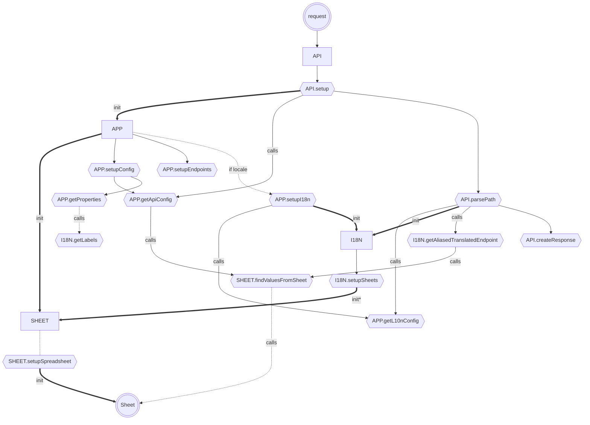
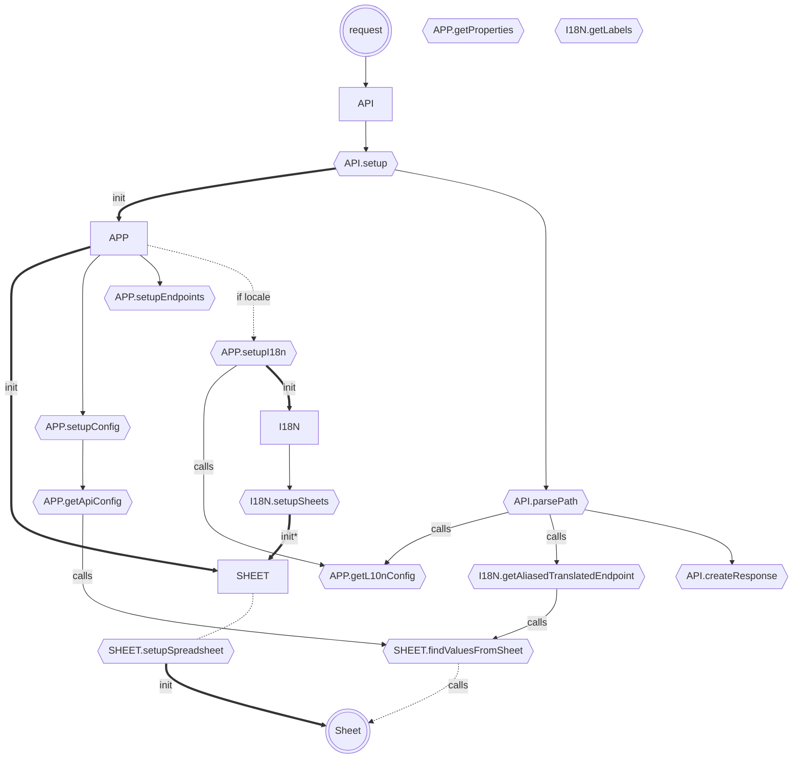

# Fluxo

---

> análise realizada no dia 2024-10-29

Como a requisição do apps script tem um limite de execução de 300 segundos (5 minutos), é necessário que o código seja o mais eficiente possível para que não haja problemas de execução, no gráfico abaixo é possível ver a sequência de chamadas que o código faz para que cada requisição seja processada, além desses passos, o código ainda vai executar outras funções baseadas no tipo de requisição recebida.

Como podemos ver no gráfico, para requisição executada pelo apps script, o código passa por várias funções, sendo que algumas delas são chamadas de forma condicional, como por exemplo a função `app_setupI18n` que só é chamada se o locale estiver presente. Além disso, o código ainda faz chamadas para a planilha para buscar os valores necessários para a execução da requisição, o que leva tempo e consome recursos, atualmente algumas requisições podem passar dos 500 segundos apresentando problemas na build do [site gatsby](../../gatsby/README.md).

Melhorias:

---
