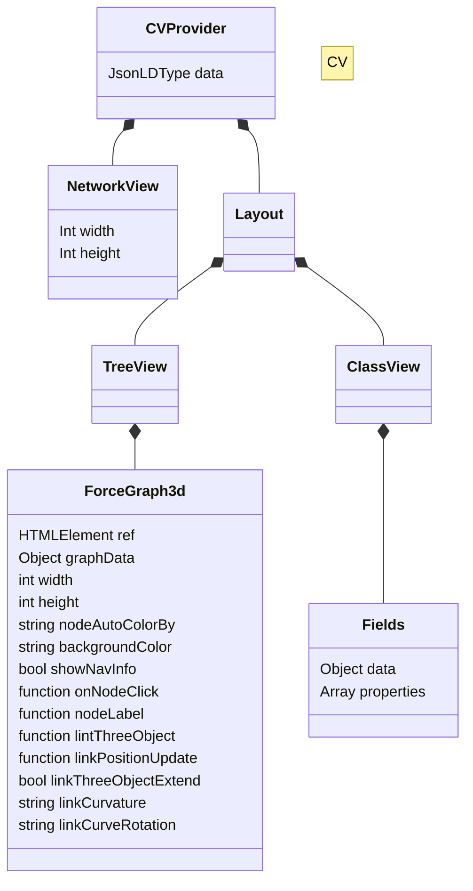

# Visualização dos componentes

```mermaid
classDiagram 
    note "CV"

    class CVProvider {
        JsonLDType data 
    }

    class NetworkView {
        Int width
        Int height
    }

    class ForceGraph3d {
        HTMLElement ref
        Object graphData
        int width
        int height
        string nodeAutoColorBy
        string backgroundColor
        bool showNavInfo
        function onNodeClick
        function nodeLabel
        function lintThreeObject
        function linkPositionUpdate
        bool linkThreeObjectExtend
        string linkCurvature
        string linkCurveRotation
    }

    class Fields {
        Object data
        Array properties
    }

    class Layout
    class TreeView
    class ClassView

    CVProvider *-- NetworkView
    CVProvider *-- Layout
    Layout *-- TreeView
    Layout *-- ClassView

    TreeView *-- ForceGraph3d

    ClassView *-- Fields

```
